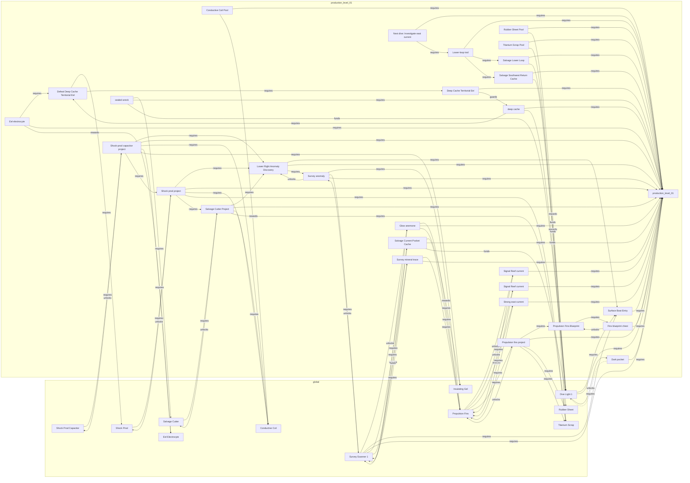

# Cross-Map Progression Graph

Generated from `config/progression_contract.json`, `config/progression_audit_views.json`, and the promoted `maps/production_level_01.greybox.json` canonical view.
Do not edit this file directly; run `python tools/audit_progression_graph.py --write`.

Status: **PASS**

## Audited Views

| View | Sources | Status | Graph |
| --- | --- | --- | --- |
| `slice_provenance` (Production slice provenance) | `maps/production_slice_01.greybox.json`, `maps/production_slice_02.greybox.json`, `maps/production_slice_03.greybox.json`, `maps/production_slice_04.greybox.json` | **PASS** | 87 nodes / 316 edges |
| `promoted_full_level` (Promoted production level) | `maps/production_level_01.greybox.json` | **PASS** | 58 nodes / 200 edges |

## Detailed Canonical View

The table and dependency diagram below describe the promoted full-level view.

### Deterministic Stages

| Stage | Item / condition | Map / route | Blocker | Prerequisite source | Unlock / payoff | Reachability |
| ---: | --- | --- | --- | --- | --- | --- |
| 0 | `production_level_01` | production_level_01 | none | source-authored | state/payoff | stage 0 |
| 1 | `Fins blueprint chest` | production_level_01 / lower_loop_reward | none | production_level_01 | Propulsion Fins Blueprint | stage 1 |
| 1 | `Surface Boat Entry` | production_level_01 | none | production_level_01 | state/payoff | stage 1 |
| 1 | `Deep Cache Territorial Eel` | production_level_01 / deep_cache_pressure | none | production_level_01 | deep cache | stage 1 |
| 1 | `Salvage Lower Loop` | production_level_01 | none | production_level_01 | state/payoff | stage 1 |
| 1 | `Salvage Southwest Return Cache` | production_level_01 | none | production_level_01 | state/payoff | stage 1 |
| 2 | `Propulsion Fins Blueprint` | production_level_01 | Fins blueprint chest | Fins blueprint chest | state/payoff | stage 2 |
| 2 | `Conductive Coil Pool` | production_level_01 | none | production_level_01 | Conductive Coil | stage 2 |
| 2 | `Rubber Sheet Pool` | production_level_01 | none | production_level_01 | Rubber Sheet | stage 2 |
| 2 | `Titanium Scrap Pool` | production_level_01 | none | production_level_01 | Titanium Scrap | stage 2 |
| 2 | `Lower-loop trail` | production_level_01 / deep_cache_commitment | Salvage Lower Loop, Salvage Southwest Return Cache | production_level_01, Salvage Lower Loop, Salvage Southwest Return Cache | state/payoff | stage 2 |
| 3 | `Conductive Coil` | global | none | Conductive Coil Pool | state/payoff | stage 3 |
| 3 | `Rubber Sheet` | global | none | Rubber Sheet Pool | state/payoff | stage 3 |
| 3 | `Titanium Scrap` | global | none | Titanium Scrap Pool | state/payoff | stage 3 |
| 3 | `Next dive: Investigate east current` | production_level_01 / upper_right_current_pocket | Lower-loop trail | production_level_01, Lower-loop trail | state/payoff | stage 3 |
| 4 | `Propulsion fins project` | production_level_01 | Propulsion Fins Blueprint, Titanium Scrap, Rubber Sheet | production_level_01, Propulsion Fins Blueprint, Titanium Scrap | Propulsion Fins | stage 4 |
| 5 | `Propulsion Fins` | global | Propulsion fins project | Propulsion fins project | Strong east current, Signal Reef current | stage 5 |
| 6 | `Signal Reef current` | production_level_01 / east_current_signal_reef_route | Propulsion Fins | production_level_01, Propulsion Fins | state/payoff | stage 6 |
| 6 | `Signal Reef current` | production_level_01 / east_current_signal_reef_route | Propulsion Fins | production_level_01, Propulsion Fins | state/payoff | stage 6 |
| 6 | `Strong east current` | production_level_01 / upper_right_current_pocket | Propulsion Fins | production_level_01, Propulsion Fins | state/payoff | stage 6 |
| 6 | `Salvage Current Pocket Cache` | production_level_01 / upper_right_current_pocket | Propulsion Fins | production_level_01, Propulsion Fins | state/payoff | stage 6 |
| 7 | `Survey Scanner 1` | global | Surface Boat Entry, Salvage Current Pocket Cache, wallet 300 | Salvage Current Pocket Cache | Survey anomaly, Survey mineral trace, Glow anemone | stage 7 |
| 8 | `Glow anemone` | production_level_01 / upper_right_current_pocket | Survey Scanner 1, Propulsion Fins | production_level_01, Survey Scanner 1, Propulsion Fins | Insulating Gel | stage 8 |
| 8 | `Survey anomaly` | production_level_01 / upper_right_current_pocket | Survey Scanner 1, Propulsion Fins | production_level_01, Survey Scanner 1, Propulsion Fins | Lower Right Anomaly Discovery | stage 8 |
| 8 | `Survey mineral trace` | production_level_01 / upper_right_current_pocket | Survey Scanner 1, Propulsion Fins | production_level_01, Survey Scanner 1, Propulsion Fins | Upper Right Mineral Trace Research | stage 8 |
| 9 | `Insulating Gel` | global | none | Glow anemone | state/payoff | stage 9 |
| 9 | `Lower Right Anomaly Discovery` | production_level_01 / upper_right_current_pocket | Survey anomaly, Surface Boat Entry | Survey anomaly, production_level_01, Surface Boat Entry | state/payoff | stage 9 |
| 10 | `Salvage Cutter Project` | production_level_01 | Lower Right Anomaly Discovery, Titanium Scrap, Conductive Coil | production_level_01, Lower Right Anomaly Discovery, Titanium Scrap | Salvage Cutter | stage 10 |
| 11 | `Salvage Cutter` | global | Salvage Cutter Project | Salvage Cutter Project | state/payoff | stage 11 |
| 11 | `Shock prod project` | production_level_01 | Salvage Cutter Project, Lower Right Anomaly Discovery, Titanium Scrap, Conductive Coil | production_level_01, Salvage Cutter Project, Lower Right Anomaly Discovery | Shock Prod | stage 11 |
| 12 | `Shock Prod` | global | Shock prod project | Shock prod project | state/payoff | stage 12 |
| 12 | `sealed wreck` | production_level_01 | Salvage Cutter | production_level_01, Salvage Cutter | state/payoff | stage 12 |
| 13 | `Defeat Deep Cache Territorial Eel` | production_level_01 / deep_cache_pressure | Deep Cache Territorial Eel, Shock Prod | Deep Cache Territorial Eel, Shock Prod | state/payoff | stage 13 |
| 14 | `Eel electrocyte` | production_level_01 / deep_cache_pressure | Defeat Deep Cache Territorial Eel | production_level_01, Defeat Deep Cache Territorial Eel | Eel Electrocyte | stage 14 |
| 14 | `deep cache` | production_level_01 | Defeat Deep Cache Territorial Eel | production_level_01, Defeat Deep Cache Territorial Eel | state/payoff | stage 14 |
| 15 | `Eel Electrocyte` | global | none | Eel electrocyte | state/payoff | stage 15 |
| 16 | `Shock-prod capacitor project` | production_level_01 | Shock prod project, Lower Right Anomaly Discovery, Conductive Coil, Insulating Gel, Eel Electrocyte | production_level_01, Shock prod project, Lower Right Anomaly Discovery | Shock Prod Capacitor | stage 16 |
| 17 | `Shock Prod Capacitor` | global | Shock-prod capacitor project | Shock-prod capacitor project | state/payoff | stage 17 |

## Soft Pressure Annotations

- Dark pocket -> Dive Light 1: soft pressure

## Dependency View

## Diagnostics

- No unresolved IDs, hard cycles, self-gated materials, guard/counter inversions, unreachable mandatory nodes, or funding-floor failures.
